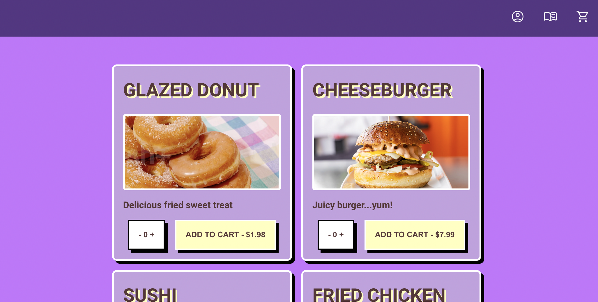
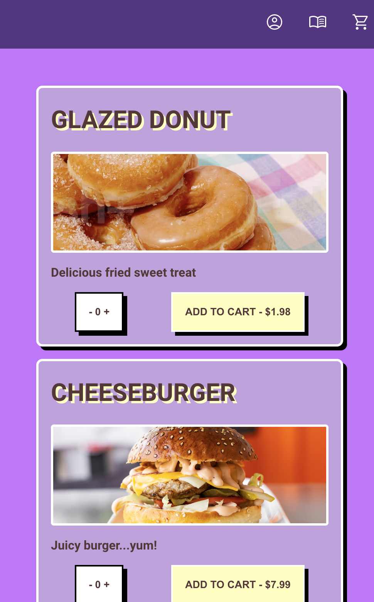

# food-order-app

## Description

This is a MERN-G full-stack application. The user can add items to cart, create a profile, customize their profile, and checkout with stripe. I created this project to showcase React skills and MVC functionality.

## Installation

- Git clone the repo
- In the root of the directory, run

```npm install```

```npm run develop```

## Usage 

- This app is not yet deployed! Link will be here when it is.




## Credits

- React.js 
- Gage Norton for final color scheme

## License

This project uses the MIT License

## How to contribute

Email me at lvforsythe95@gmail.com , I love to collab!

